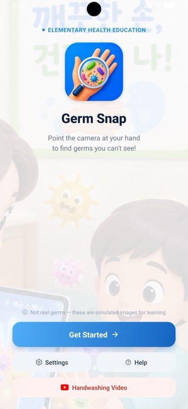
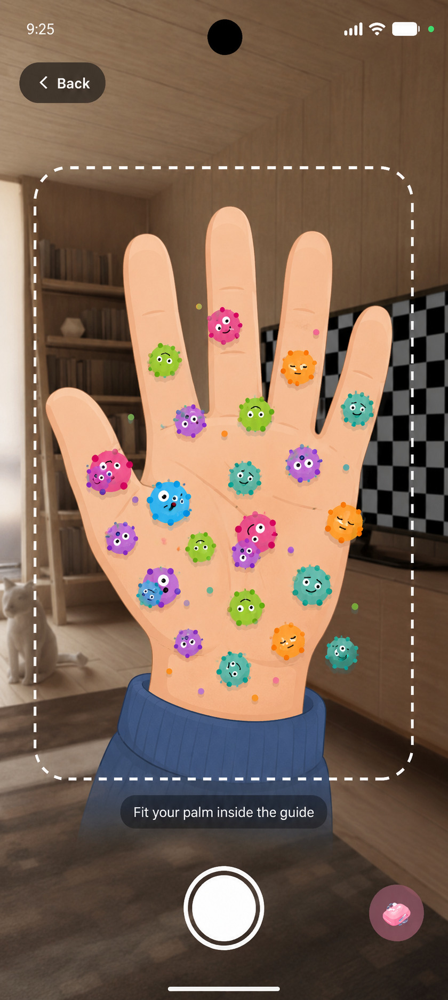
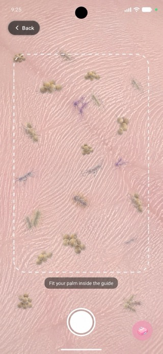
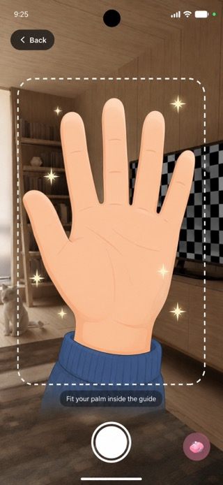
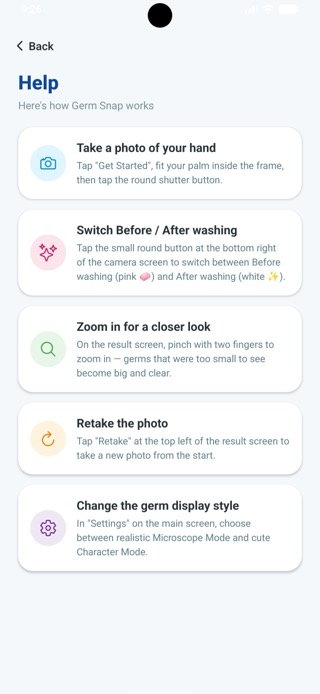

# 🧼 보건교육용 Germ Snap (세균 카메라)

> **On-Device AI 기반 초등학교 보건교육용 손 세균 시각화 모바일 앱**  
> 아이들이 손 씻기의 중요성을 눈으로 직접 확인하고 즐겁게 습관화할 수 있도록 돕는 오프라인 교육 도구입니다.

[](https://yonghun16.github.io/GermSnap)
[](https://expo.dev)
[](https://www.typescriptlang.org/)

<p align="center">
  
</p>

---

## 📌 프로젝트 개요 (Overview)

학교 현장의 인터넷 환경이 불안정하거나 Wi-Fi 연결이 어려운 상황을 고려하여 **100% On-Device 오프라인**으로 작동합니다.  
단일 정지 이미지 분석을 통해 저사양 스마트폰/태블릿에서도 빠르게 손 위치를 추적하고, 손 씻기 전/후 모드에 따라 맞춤형 그래픽 이펙트를 합성합니다.

- **타겟 사용자**: 초등학생 및 보건교사
- **핵심 목표**: 손 씻기 전 세균 시각화 및 손 씻은 후 칭찬 이펙트를 통한 보건교육 효과 극대화
- **웹 명세서**: 🔗 [온라인 개발 명세서 바로가기](https://yonghun16.github.io/GermSnap)

---

## ✨ 주요 기능 (Key Features)

- 📸 **카메라 가이드라인 & 촬영**: 손 모양 오버레이 가이드에 맞춰 안정적인 스캔 지원
- 🤖 **On-Device AI 손 인식**: 자체 구현 2단계 TFLite 파이프라인으로 21개 손 관절 좌표 추출 (서버 통신 없음)
- 🦠 **손 씻기 전 모드 (`BEFORE`)**: 손 좌표 주변에 무작위 세균 그래픽(15~30개) 자동 오버레이
- ✨ **손 씻은 후 모드 (`AFTER`)**: 세균 제거 및 반짝이/비눗방울 이펙트 + 칭찬 팝업 연출
- 🔬 **캐릭터 / 현미경 표시 모드**: 표정 있는 캐릭터형 세균과 사실적인 현미경형 세균 중 선택 가능 (설정에 영구 저장)
- 🌏 **4개 언어 지원**: 기기 언어(한국어/영어/일본어/중국어)에 맞춰 UI가 자동 전환
- 🎬 **인앱 손 씻기 영상**: 홈 화면에서 올바른 손 씻기 방법 영상을 앱 이탈 없이 바로 재생
- 🔍 **Pinch Zoom 관절 밀착 관찰**: 최대 4배 확대하여 손톱 밑이나 손가락 마디 세균 상세 관찰
- 🤫 **보건교사용 히든 버튼**: 화면 우하단 스텔스 버튼을 통해 즉시 깨끗해진 손으로 모드 전환 가능

---

## 📱 스크린샷 (Screenshots)

<table>
  <tr>
    <td align="center"><br/>홈 화면</td>
    <td align="center"><br/>세균 스캔 (BEFORE)</td>
    <td align="center"><br/>세균 확대 관찰</td>
    <td align="center"><br/>손 씻은 후 (AFTER)</td>
    <td align="center"><br/>사용 방법 안내</td>
  </tr>
</table>

---

## 🛠️ 기술 스택 (Tech Stack)

| 구분 | 기술 / 라이브러리 | 용도 |
| :--- | :--- | :--- |
| **Framework** | React Native (Expo Bare Workflow, New Architecture) | Cross-platform 모바일 앱 |
| **Language** | TypeScript | 타입 안정성 및 명세서 일치성 확보 |
| **AI / ML** | `react-native-fast-tflite` (Nitro Modules) | palm 검출 → 손 회전 정렬 크롭 → 21개 landmark 추출, 완전 오프라인 |
| **Graphics** | `@shopify/react-native-skia` | 고성능 2D 세균 및 이펙트 캔버스 렌더링 |
| **Gestures & Animation** | `react-native-gesture-handler`, `reanimated`, `react-native-worklets` | Pinch Zoom + Pan, 세균 애니메이션 |
| **Camera / 이미지 처리** | `expo-camera`, `expo-image-manipulator` | 정지 이미지 캡처 및 미리보기 비율 크롭 |
| **다국어** | `i18next`, `react-i18next`, `expo-localization` | 기기 언어 자동 감지 후 4개 언어 UI 전환 |
| **인앱 영상** | `react-native-youtube-iframe`, `react-native-webview` | 손 씻기 영상 인앱 전체화면 재생 |
| **저장소** | `@react-native-async-storage/async-storage` | 세균 표시 모드 등 사용자 설정 영구 저장 |
| **Feedback** | `expo-haptics` | 스캔/성공/실패 진동 (효과음은 현재 준비 중, 아래 참고) |
| **Docs Engine**| Quartz v5 | 옵시디언 기반 명세 문서 정적 웹사이트 자동 배포 |

---

## 🚀 시작하기 (Getting Started)

```bash
# 의존성 설치
npm install

# 네이티브 프로젝트 생성 (최초 1회, 또는 app.json 설정 변경 시)
npx expo prebuild

# 개발 서버 실행
npx expo start

# iOS 실기기/시뮬레이터 실행
npx expo run:ios

# Android 실기기/에뮬레이터 실행
npx expo run:android
```

> ⚠️ 카메라 + On-Device AI 앱 특성상 시뮬레이터보다 **실기기 테스트**를 권장합니다.

---

## 📁 프로젝트 구조 (Directory Structure)

```text
GermSnap/
 ├── CLAUDE.md                   # AI 에이전트 개발 지침서
 ├── README.md                   # 프로젝트 메인 안내 문서
 ├── app.json                    # Expo 설정 (버전, 패키지명, 권한 등)
 ├── docs/                       # 명세 문서 사이트 (Quartz v5 기반)
 │    └── content/
 │         ├── 00_Overview.md
 │         ├── 01_Architecture_Flow.md
 │         ├── 02_Camera_and_AI.md
 │         ├── 03_Germ_and_Clean_Rendering.md
 │         ├── 04_Asset_and_Development_Guide.md
 │         └── notes/            # 세부 주제별 개별 노드 문서
 ├── assets/                     # 세균 PNG, 아이콘 등 정적 에셋
 ├── locales/                    # i18next 번역 리소스
 ├── plugins/                    # Expo config plugin (릴리즈 서명 등)
 ├── store-assets/               # Play 스토어 스크린샷 / 피처 이미지
 ├── src/
 │    ├── components/            # GermSprite, SparkleSprite 등 Skia 렌더링 컴포넌트
 │    ├── screens/               # Home / Camera / Result / Settings / Help Screen
 │    ├── utils/                 # 손 좌표 분석(TFLite), 세균 생성, 다국어, 사운드 헬퍼
 │    └── types/                 # AppState, WashMode 등 타입 정의
 └── android/, ios/              # `expo prebuild`로 생성되는 네이티브 프로젝트 (git 미추적)
```

---

## 🔧 개발 하이라이트 (Engineering Highlights)

- **오프라인 2단계 손 인식 파이프라인**: 서버 API 없이 `react-native-fast-tflite`(Nitro Modules) 기반으로 palm 검출 → 손 회전 정렬 크롭 → 21개 landmark 추출까지 자체 구현. 손이 기울어진 상태에서도 인식률을 유지하기 위해 회전 정렬 단계를 추가했습니다.
- **릴리즈 빌드 전용 크래시 대응**: 개발 빌드에서는 문제없던 TFLite 모델 로딩이 릴리즈 APK에서만 실패하는 이슈, `expo-av` 사운드 재생이 실기기에서 `UnsatisfiedLinkError`를 일으키는 이슈를 각각 원인 분석 후 해결/우회했습니다.
- **촬영 프레임 ↔ 미리보기 정합**: 카메라 미리보기와 실제 캡처된 사진의 비율이 어긋나던 문제를 `expo-image-manipulator` 네이티브 크롭으로 해결했습니다.
- **좌표계 변환 일관성**: TFLite의 정규화 좌표(0~1)를 Skia Canvas 픽셀 좌표로 변환하는 과정(`x * canvasWidth`, `y * canvasHeight`)을 전 렌더링 로직에 일관 적용해 좌표 오차를 방지했습니다.
- **다국어 아키텍처**: `i18next` 기반으로 한국어/영어/일본어/중국어 4개 언어를 지원하며, `expo-localization`으로 OS 언어를 감지해 별도 설정 없이 자동 전환됩니다.

---

## 📄 라이선스

개인 포트폴리오 및 학습 목적으로 제작된 프로젝트입니다. 별도의 오픈소스 라이선스는 지정되어 있지 않습니다.
